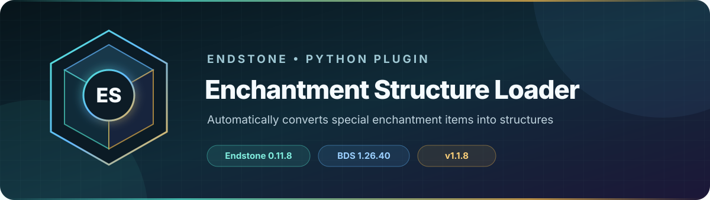

<!-- endstone-professional-header:start -->
<p align="center">
  
</p>

<p align="center">
  <a href="https://github.com/TheNINJALLO/endstone-enchantment-structure-loader/actions/workflows/wheel-release.yml"></a>
  <a href="https://github.com/TheNINJALLO/endstone-enchantment-structure-loader/releases/latest"></a>
</p>

<p align="center">
  
  
  
  =3.10" src="https://img.shields.io/badge/Python-%3E=3.10-3776AB?style=flat-square&amp;logo=python&amp;logoColor=white">
</p>

<p align="center">
  <strong>Automatically converts special enchantment items into structures.</strong>
</p>

<p align="center">
  <a href="#overview">Overview</a> &bull;
  <a href="#compatibility">Compatibility</a> &bull;
  <a href="#install">Install</a> &bull;
  <a href="https://github.com/TheNINJALLO/endstone-enchantment-structure-loader/releases">Releases</a>
</p>

## Overview

Automatically converts special enchantment items into structures. This release is aligned with Endstone 0.11.8 and Minecraft Bedrock Dedicated Server 1.26.40, and is distributed as a Python wheel for direct installation in an Endstone server.

## Capabilities

-

## Compatibility

| Component | Supported version |
|---|---|
| Endstone | `0.11.8` |
| Endstone API | `0.11` |
| Bedrock Dedicated Server | `1.26.40` |
| Python | `>=3.10` |
| Plugin release | `v1.1.8` |

## Install

Download the wheel from the matching GitHub release:

```bash
gh release download v1.1.8 --repo TheNINJALLO/endstone-enchantment-structure-loader --pattern "*.whl"
```

Copy the downloaded wheel into the server's `plugins/` directory, remove any older wheel for the same plugin, and restart Endstone.

> [!IMPORTANT]
> Use Endstone `0.11.8` with BDS `1.26.40`. Back up worlds and plugin data before upgrading a production server.

## Configuration and secrets

Runtime databases, logs, local `.env` files, server directories, and root `config.toml` files are excluded from source releases. When an example configuration is provided, copy it locally and keep live tokens, passwords, webhook URLs, and server identifiers out of Git.

## Release automation

Every `v*` tag runs [the wheel release workflow](.github/workflows/wheel-release.yml), builds the package in a clean GitHub runner, stores the wheel as a workflow artifact, and attaches it to the matching GitHub release.
<!-- endstone-professional-header:end -->

---

## Project guide

## Full Directory Structure with File Paths

```
endstone-enchantment-structure-loader/
├── pyproject.toml
├── README.md
└── src/
    └── enchantment_structure_loader/
        ├── __init__.py
        └── plugin.py
```

---

## File: `endstone-enchantment-structure-loader/pyproject.toml`

```toml
[build-system]
requires = ["setuptools>=68.0", "wheel"]
build-backend = "setuptools.build_meta"

[project]
name = "endstone-enchantment-structure-loader"
version = "1.0.0"
description = "Automatically converts special enchantment items into structures"
readme = "README.md"
requires-python = ">=3.9"
authors = [
    {name = "Your Name", email = "your.email@example.com"}
]
dependencies = [
    "endstone>=0.11.8,<0.12",
]

[project.entry-points."endstone"]
enchantment_structure_loader = "enchantment_structure_loader.plugin:EnchantmentStructureLoader"

[tool.setuptools.packages.find]
where = ["src"]
include = ["enchantment_structure_loader*"]
```

---

## File: `endstone-enchantment-structure-loader/src/enchantment_structure_loader/__init__.py`

```python
"""Enchantment Structure Loader Plugin for Endstone"""

from endstone.plugin import Plugin

__version__ = "1.0.0"
```

---

## File: `endstone-enchantment-structure-loader/src/enchantment_structure_loader/plugin.py`

```python
from endstone.plugin import Plugin

ENCHANTMENT_ITEMS = [
    {"id": "z:banearthropodsviii", "structure": "banearthropods/viii"},
    {"id": "z:banearthropodsvi", "structure": "banearthropods/vi"},
    {"id": "z:banearthropodsix", "structure": "banearthropods/ix"},
    {"id": "z:banearthropodsx", "structure": "banearthropods/x"},
    {"id": "z:banearthropodsvii", "structure": "banearthropods/vii"},
    {"id": "z:depthstrideriv", "structure": "depthstrider/iv"},
    {"id": "z:depthstridervi", "structure": "depthstrider/vi"},
    {"id": "z:depthstriderv", "structure": "depthstrider/v"},
    {"id": "z:depthstriderviii", "structure": "depthstrider/viii"},
    {"id": "z:depthstriderix", "structure": "depthstrider/ix"},
    {"id": "z:depthstriderx", "structure": "depthstrider/x"},
    {"id": "z:depthstridervii", "structure": "depthstrider/vii"},
    {"id": "z:efficiencyvii", "structure": "efficiency/vii"},
    {"id": "z:efficiencyix", "structure": "efficiency/ix"},
    {"id": "z:efficiencyvi", "structure": "efficiency/vi"},
    {"id": "z:efficiencyviii", "structure": "efficiency/viii"},
    {"id": "z:efficiencyx", "structure": "efficiency/x"},
    {"id": "z:featherfallingvi", "structure": "featherfalling/vi"},
    {"id": "z:featherfallingviii", "structure": "featherfalling/viii"},
    {"id": "z:featherfallingv", "structure": "featherfalling/v"},
    {"id": "z:featherfallingx", "structure": "featherfalling/x"},
    {"id": "z:featherfallingvii", "structure": "featherfalling/vii"},
    {"id": "z:featherfallingix", "structure": "featherfalling/ix"},
    {"id": "z:fireaspectiv", "structure": "fireaspect/iv"},
    {"id": "z:fireaspectix", "structure": "fireaspect/ix"},
    {"id": "z:fireaspectiii", "structure": "fireaspect/iii"},
    {"id": "z:fireaspectv", "structure": "fireaspect/v"},
    {"id": "z:fireaspectvi", "structure": "fireaspect/vi"},
    {"id": "z:fireaspectviii", "structure": "fireaspect/viii"},
    {"id": "z:fireaspectvii", "structure": "fireaspect/vii"},
    {"id": "z:fireaspectx", "structure": "fireaspect/x"},
    {"id": "z:fortunev", "structure": "fortune/v"},
    {"id": "z:fortuneiv", "structure": "fortune/iv"},
    {"id": "z:fortunex", "structure": "fortune/x"},
    {"id": "z:fortunevi", "structure": "fortune/vi"},
    {"id": "z:fortunevii", "structure": "fortune/vii"},
    {"id": "z:fortuneviii", "structure": "fortune/viii"},
    {"id": "z:fortuneix", "structure": "fortune/ix"},
    {"id": "z:frostwalkerix", "structure": "frostwalker/ix"},
    {"id": "z:frostwalkeriv", "structure": "frostwalker/iv"},
    {"id": "z:frostwalkervi", "structure": "frostwalker/vi"},
    {"id": "z:frostwalkerv", "structure": "frostwalker/v"},
    {"id": "z:frostwalkeriii", "structure": "frostwalker/iii"},
    {"id": "z:frostwalkerviii", "structure": "frostwalker/viii"},
    {"id": "z:frostwalkervii", "structure": "frostwalker/vii"},
    {"id": "z:frostwalkerx", "structure": "frostwalker/x"},
    {"id": "z:impalingix", "structure": "impaling/ix"},
    {"id": "z:impalingx", "structure": "impaling/x"},
    {"id": "z:impalingvii", "structure": "impaling/vii"},
    {"id": "z:impalingvi", "structure": "impaling/vi"},
    {"id": "z:impalingviii", "structure": "impaling/viii"},
    {"id": "z:knockbackviii", "structure": "knockback/viii"},
    {"id": "z:knockbackv", "structure": "knockback/v"},
    {"id": "z:knockbackvii", "structure": "knockback/vii"},
    {"id": "z:knockbackiii", "structure": "knockback/iii"},
    {"id": "z:knockbackix", "structure": "knockback/ix"},
    {"id": "z:knockbackiv", "structure": "knockback/iv"},
    {"id": "z:knockbackx", "structure": "knockback/x"},
    {"id": "z:knockbackvi", "structure": "knockback/vi"},
    {"id": "z:lootingiv", "structure": "looting/iv"},
    {"id": "z:lootingvi", "structure": "looting/vi"},
    {"id": "z:lootingv", "structure": "looting/v"},
    {"id": "z:lootingix", "structure": "looting/ix"},
    {"id": "z:lootingviii", "structure": "looting/viii"},
    {"id": "z:lootingvii", "structure": "looting/vii"},
    {"id": "z:lootingx", "structure": "looting/x"},
    {"id": "z:loyalityx", "structure": "loyality/x"},
    {"id": "z:loyalityvi", "structure": "loyality/vi"},
    {"id": "z:loyalityix", "structure": "loyality/ix"},
    {"id": "z:loyalityvii", "structure": "loyality/vii"},
    {"id": "z:loyalityv", "structure": "loyality/v"},
    {"id": "z:loyalityiv", "structure": "loyality/iv"},
    {"id": "z:loyalityviii", "structure": "loyality/viii"},
    {"id": "z:luckseax", "structure": "lucksea/x"},
    {"id": "z:luckseavii", "structure": "lucksea/vii"},
    {"id": "z:luckseav", "structure": "lucksea/v"},
    {"id": "z:luckseaviii", "structure": "lucksea/viii"},
    {"id": "z:luckseaix", "structure": "lucksea/ix"},
    {"id": "z:luckseavi", "structure": "lucksea/vi"},
    {"id": "z:luckseaiv", "structure": "lucksea/iv"},
    {"id": "z:lureiv", "structure": "lure/iv"},
    {"id": "z:lurev", "structure": "lure/v"},
    {"id": "z:piercingviii", "structure": "piercing/viii"},
    {"id": "z:piercingvi", "structure": "piercing/vi"},
    {"id": "z:piercingix", "structure": "piercing/ix"},
    {"id": "z:piercingvii", "structure": "piercing/vii"},
    {"id": "z:piercingv", "structure": "piercing/v"},
    {"id": "z:piercingx", "structure": "piercing/x"},
    {"id": "z:powervii", "structure": "power/vii"},
    {"id": "z:powerviii", "structure": "power/viii"},
    {"id": "z:powervi", "structure": "power/vi"},
    {"id": "z:powerix", "structure": "power/ix"},
    {"id": "z:powerx", "structure": "power/x"},
    {"id": "z:protectionx", "structure": "protection/x"},
    {"id": "z:protectionvi", "structure": "protection/vi"},
    {"id": "z:protectionvii", "structure": "protection/vii"},
    {"id": "z:protectionix", "structure": "protection/ix"},
    {"id": "z:protectionxi", "structure": "protection/x"},
    {"id": "z:protectionviii", "structure": "protection/viii"},
    {"id": "z:protectionxii", "structure": "protection/x"},
    {"id": "z:protectionv", "structure": "protection/v"},
    {"id": "z:protectionxiii", "structure": "protection/x"},
    {"id": "z:protectionxiv", "structure": "protection/x"},
    {"id": "z:protectionxix", "structure": "protection/x"},
    {"id": "z:protectionxv", "structure": "protection/x"},
    {"id": "z:protectionxvii", "structure": "protection/x"},
    {"id": "z:protectionxx", "structure": "protection/x"},
    {"id": "z:protectionxvi", "structure": "protection/x"},
    {"id": "z:protectionxviii", "structure": "protection/x"},
    {"id": "z:protectionexplv", "structure": "protectionexpl/v"},
    {"id": "z:protectionexplvii", "structure": "protectionexpl/vii"},
    {"id": "z:protectionexplx", "structure": "protectionexpl/x"},
    {"id": "z:protectionexplviii", "structure": "protectionexpl/viii"},
    {"id": "z:protectionexplix", "structure": "protectionexpl/ix"},
    {"id": "z:protectionexplvi", "structure": "protectionexpl/vi"},
    {"id": "z:protectionfireix", "structure": "protectionfire/ix"},
    {"id": "z:protectionfirevi", "structure": "protectionfire/vi"},
    {"id": "z:protectionfirev", "structure": "protectionfire/v"},
    {"id": "z:protectionfireviii", "structure": "protectionfire/viii"},
    {"id": "z:protectionfirevii", "structure": "protectionfire/vii"},
    {"id": "z:protectionfirex", "structure": "protectionfire/x"},
    {"id": "z:protectionprojviii", "structure": "protectionproj/viii"},
    {"id": "z:protectionprojix", "structure": "protectionproj/ix"},
    {"id": "z:protectionprojx", "structure": "protectionproj/x"},
    {"id": "z:protectionprojvi", "structure": "protectionproj/vi"},
    {"id": "z:protectionprojv", "structure": "protectionproj/v"},
    {"id": "z:protectionprojvii", "structure": "protectionproj/vii"},
    {"id": "z:punchvii", "structure": "punch/vii"},
    {"id": "z:punchiii", "structure": "punch/iii"},
    {"id": "z:punchvi", "structure": "punch/vi"},
    {"id": "z:punchiv", "structure": "punch/iv"},
    {"id": "z:punchv", "structure": "punch/v"},
    {"id": "z:punchviii", "structure": "punch/viii"},
    {"id": "z:punchx", "structure": "punch/x"},
    {"id": "z:punchix", "structure": "punch/ix"},
    {"id": "z:quickchargeiv", "structure": "quickcharge/iv"},
    {"id": "z:quickchargev", "structure": "quickcharge/iv"},
    {"id": "z:respirationvii", "structure": "respiration/vii"},
    {"id": "z:respirationiv", "structure": "respiration/iv"},
    {"id": "z:respirationx", "structure": "respiration/x"},
    {"id": "z:respirationix", "structure": "respiration/ix"},
    {"id": "z:respirationv", "structure": "respiration/v"},
    {"id": "z:respirationvi", "structure": "respiration/vi"},
    {"id": "z:respirationviii", "structure": "respiration/viii"},
    {"id": "z:riptideiv", "structure": "riptide/iv"},
    {"id": "z:riptidevii", "structure": "riptide/vii"},
    {"id": "z:riptidev", "structure": "riptide/v"},
    {"id": "z:firetidei", "structure": "riptide/firetidei"},
    {"id": "z:riptideix", "structure": "riptide/ix"},
    {"id": "z:riptidevi", "structure": "riptide/vi"},
    {"id": "z:riptidex", "structure": "riptide/x"},
    {"id": "z:riptideviii", "structure": "riptide/viii"},
    {"id": "z:sharpnessix", "structure": "sharpness/ix"},
    {"id": "z:sharpnessvi", "structure": "sharpness/vi"},
    {"id": "z:sharpnessx", "structure": "sharpness/x"},
    {"id": "z:sharpnessviii", "structure": "sharpness/viii"},
    {"id": "z:sharpnessvii", "structure": "sharpness/vii"},
    {"id": "z:smitex", "structure": "smite/x"},
    {"id": "z:smitevi", "structure": "smite/vi"},
    {"id": "z:smiteviii", "structure": "smite/viii"},
    {"id": "z:smiteix", "structure": "smite/ix"},
    {"id": "z:smitevii", "structure": "smite/vii"},
    {"id": "z:soulspeedvii", "structure": "soulspeed/vii"},
    {"id": "z:soulspeediv", "structure": "soulspeed/iv"},
    {"id": "z:soulspeedix", "structure": "soulspeed/ix"},
    {"id": "z:soulspeedv", "structure": "soulspeed/v"},
    {"id": "z:soulspeedx", "structure": "soulspeed/x"},
    {"id": "z:soulspeedviii", "structure": "soulspeed/viii"},
    {"id": "z:soulspeedvi", "structure": "soulspeed/vi"},
    {"id": "z:swiftsneakiv", "structure": "swiftsneak/iv"},
    {"id": "z:swiftsneakv", "structure": "swiftsneak/v"},
    {"id": "z:thornsx", "structure": "thorns/x"},
    {"id": "z:thornsix", "structure": "thorns/ix"},
    {"id": "z:thornsiv", "structure": "thorns/iv"},
    {"id": "z:thornsviii", "structure": "thorns/viii"},
    {"id": "z:thornsvi", "structure": "thorns/vi"},
    {"id": "z:thornsvii", "structure": "thorns/vii"},
    {"id": "z:thornsv", "structure": "thorns/v"},
    {"id": "z:unbreakingiv", "structure": "unbreaking/iv"},
    {"id": "z:unbreakingix", "structure": "unbreaking/ix"},
    {"id": "z:unbreakingvi", "structure": "unbreaking/vi"},
    {"id": "z:unbreakingv", "structure": "unbreaking/v"},
    {"id": "z:unbreakingvii", "structure": "unbreaking/vii"},
    {"id": "z:unbreakingviii", "structure": "unbreaking/viii"},
    {"id": "z:unbreakingx", "structure": "unbreaking/x"},
]


class EnchantmentStructureLoader(Plugin):
    api_version = "0.11"
    
    def on_load(self) -> None:
        """Called when the plugin is loaded"""
        self.logger.info("Loading Enchantment Structure Loader...")
        self.enchant_map = {item["id"]: item["structure"] for item in ENCHANTMENT_ITEMS}
    
    def on_enable(self) -> None:
        """Called when the plugin is enabled"""
        self.logger.info("Enchantment Structure Loader plugin enabled!")
        self.logger.info(f"Monitoring {len(self.enchant_map)} enchantment items")
        
        # Schedule repeating task to check inventories every second (20 ticks)
        self.server.scheduler.run_task(
            plugin=self,
            task=self.check_inventories,
            delay=0,
            period=20
        )
    
    def on_disable(self) -> None:
        """Called when the plugin is disabled"""
        self.logger.info("Enchantment Structure Loader plugin disabled!")
    
    def check_inventories(self) -> None:
        """Check all players' inventories for enchantment items"""
        try:
            for player in self.server.online_players:
                inventory = player.inventory
                if not inventory:
                    continue
                
                # Check all inventory slots
                for slot in range(inventory.size):
                    try:
                        item = inventory.get_item(slot)
                        if not item:
                            continue
                        
                        # Get the string ID of the item type
                        item_type_id = str(item.type)
                        
                        # Check if this item matches any enchantment item
                        if item_type_id in self.enchant_map:
                            structure_name = self.enchant_map[item_type_id]
                            
                            # Remove the item from inventory
                            inventory.set_item(slot, None)
                            
                            # Load structure at player's location
                            player.perform_command(f'structure load "{structure_name}" ~ ~ ~')
                            
                            self.logger.info(
                                f"Loaded structure '{structure_name}' for player {player.name}"
                            )
                    except Exception as e:
                        self.logger.error(f"Error checking slot {slot}: {e}")
                        continue
        except Exception as e:
            self.logger.error(f"Error in check_inventories: {e}")
```

---

## File: `endstone-enchantment-structure-loader/README.md`

```markdown
# Enchantment Structure Loader

An Endstone plugin that automatically converts special enchantment items into structures.

## Installation

1. Install the plugin:
   ```bash
   cd endstone-enchantment-structure-loader
   pip install .
   ```

2. Restart your Endstone server

3. Check the console for: `"Enchantment Structure Loader plugin enabled!"`

## Troubleshooting

### Plugin not loading?

Check the following:

1. **Install the plugin properly:**
   ```bash
   pip install /path/to/enchantment-structure-loader
   ```

2. **Verify installation:**
   ```bash
   pip list | grep enchantment
   ```

3. **Check Endstone version:**
   ```bash
   endstone --version
   ```
   Should be 0.11.x

4. **Check logs for errors** in the Endstone console

5. **Verify file structure:**
   ```
   endstone-enchantment-structure-loader/
   ├── pyproject.toml
   ├── README.md
   └── src/
       └── enchantment_structure_loader/
           ├── __init__.py
           └── plugin.py
   ```

### Still not working?

Try these debugging steps:

1. Check if Python can import the plugin:
   ```python
   python -c "from enchantment_structure_loader.plugin import EnchantmentStructureLoader; print('OK')"
   ```

2. Look for error messages in logs

3. Ensure the entry point is registered:
   ```bash
   pip show -f endstone-enchantment-structure-loader
   ```

## Requirements

- Python 3.9+
- Endstone 0.11.8+
```

---

## Installation Instructions

### Step 1: Create the files
```bash
mkdir -p endstone-enchantment-structure-loader/src/enchantment_structure_loader
cd endstone-enchantment-structure-loader

# Create the files with the content above
nano pyproject.toml
nano README.md
nano src/enchantment_structure_loader/__init__.py
nano src/enchantment_structure_loader/plugin.py
```

### Step 2: Install the plugin
```bash
# From inside the endstone-enchantment-structure-loader directory
pip install .
```

### Step 3: Restart Endstone

The plugin should now load and you'll see:
```
[INFO] Loading Enchantment Structure Loader...
[INFO] Enchantment Structure Loader plugin enabled!
[INFO] Monitoring 200 enchantment items
```

---

## Common Issues & Solutions

### Issue: Plugin doesn't appear in console

**Solution 1:** Install via pip
```bash
pip install /full/path/to/endstone-enchantment-structure-loader
```

**Solution 2:** Check the entry point name matches
In `pyproject.toml`, the entry point must be:
```toml
[project.entry-points."endstone"]
enchantment_structure_loader = "enchantment_structure_loader.plugin:EnchantmentStructureLoader"
```

**Solution 3:** Verify the plugin class has `api_version`
```python
class EnchantmentStructureLoader(Plugin):
    api_version = "0.11"  # This is required!
```

### Issue: Import errors

Make sure `__init__.py` exists and contains:
```python
"""Enchantment Structure Loader Plugin for Endstone"""

from endstone.plugin import Plugin

__version__ = "1.0.0"
```

### Issue: Can't find the plugin

Run this to check if it's installed:
```bash
python -c "import enchantment_structure_loader; print('Found!')"
```

If that fails, reinstall:
```bash
pip uninstall endstone-enchantment-structure-loader -y
pip install /path/to/endstone-enchantment-structure-loader
```
